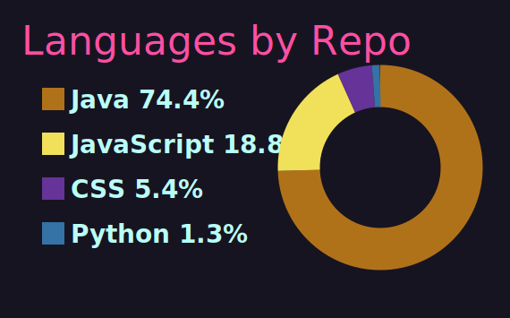

<p align="center">
  
</p>


## About me

```txt
status: 2nd-year Software Engineering student
started: 2024
main quest: survive ITMO labs and write code that actually works
side quests: web, backend, algorithms, math, architecture, Docker, Gradle
mood: probably nothing... until it compiles
```

I’m learning software engineering .

Sometimes I write clean code.
Sometimes I write a костыль.
But the main thing is that I understand why it broke and how to fix it.


<p align="left">
  
</p>

<table>
  <tr>
    <td colspan="2" align="center">
      
    </td>
  </tr>
  <tr>
    <td align="center" width="50%">
      
    </td>
    <td align="center" width="50%">
      
    </td>
  </tr>
</table>

---

<p align="center">
  
</p>

<p align="center">
  <b>Probably nothing.</b>
</p>
